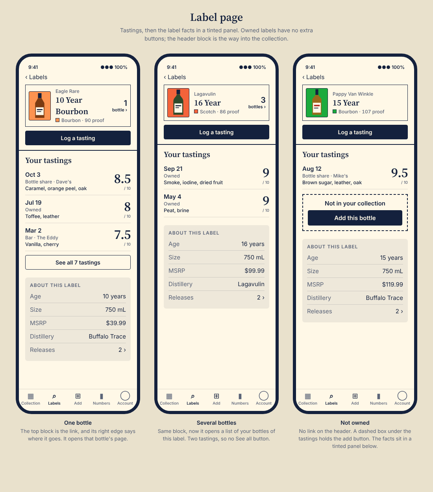
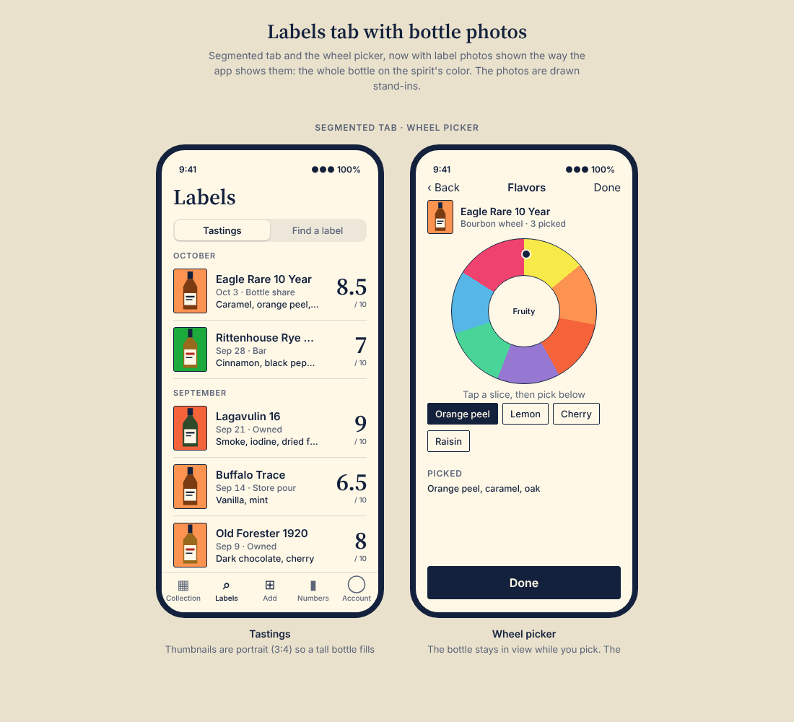

# Tasting log (M9): design

Status: decided in conversation on 2026-10-06; the phone's Labels tab and label page were refined on 2026-10-07 (section 8).
Builds on `SPEC.md` M9 ("Tastings beyond the shelf") and section 11.4 and 11.5 of
`2026-10-05-design-language-design.md`. Where this file and M9 disagree, this file is newer.

## 1. What is decided

| Question | Decision |
| --- | --- |
| What does a tasting belong to? | A label (expression), always. A bottle is optional. (M9, unchanged) |
| Where is the tasting from? | A **source**: owned, bar, bottle share, sample, store pour. Picking one of your own bottles sets *owned* automatically. |
| Where was it drunk? | **Tasted at**, free text (a bar, a friend's kitchen). Optional. |
| How is it written? | **Descriptors** (the wheel's own words, such as lemon or cinnamon) chosen from the family's official flavor wheel, plus optional free text. Nose, palate, finish and overall stay as optional text, as today. A tasting stores a flat list of descriptor keys; the wheel's category and subcategory are known from the key and are how the phone groups them. |
| Which wheel? | One **official flavor wheel per spirit family** (the families the label form already uses), not lists we write ourselves. Sources and status in section 5. |
| Rating | Unchanged: 0 to 10 in half steps, optional. Nothing is converted. |
| Searching | The Labels tab searches labels only (decided with the tab), in its second segment. Searching inside tasting text is not part of this. |

## 2. Data model

One migration, written by hand (drizzle-kit generate does not work here), with its journal entry.

`tasting_notes` gains:

- `owner_id`, not null, backfilled from the note's bottle. A note with no bottle still has an owner.
- `expression_id`, not null, backfilled from the note's bottle. Foreign key to the owner's own label, following the existing `(ref, owner_id)` composite-key pattern so a note cannot point at another account's label.
- `source` text, not null, default `owned`, checked against the five values. Existing notes become `owned`.
- `tasted_at` text, nullable.
- `tags` text array, not null, default empty. Holds tag keys.

`bottle_id` becomes nullable. A note's bottle must be a bottle of the note's label: a composite key if the schema can carry one, otherwise a check in the write path (to be settled when the migration is written).

**Decided: deleting a bottle keeps its tastings.** The bottle key is `ON DELETE SET NULL (bottle_id)` (Postgres 15 and later), so a note stays on its label with no bottle and keeps its source. This changes today's behavior, where deleting a bottle deleted its notes, and the delete confirmation says so. Deleting a label still deletes its tastings.

Nothing already recorded moves: every existing note gets its label, owner and `owned` source from its bottle.

## 3. Server

- The queries that find notes through the bottle (`tastingNotesForLabel`, `queryTastings`, the label page) read the note's own `expression_id`, with the bottle optional, so unowned pours appear on the label page and in the history.
- The bottle-scoped note routes keep working and fill in the new columns (label from the bottle, source `owned`).
- New: `POST /api/v1/tastings` (`expressionId`, optional `bottleId`, `source`, `tastedAt`, `tastedOn`, `rating`, `tags`, and the text fields), `PATCH` and `DELETE /api/v1/tastings/:id`.
- `GET /api/v1/tastings` and the label route return `source`, `tastedAt`, `tags` and a nullable `bottleId`.
- New: `GET /api/v1/tasting-tags` returns the lists by family; the categories route returns each category's family so the app knows which list to show.
- Tags are validated against the family's list on write. A tag later removed from a list is still shown from what is stored.

## 4. The phone flow (Log a tasting)

1. **Find the label.** The same screen as Add a bottle: a name search and a scan button, with the typed-code fallback. A scan that finds nothing, and the "no label found" case, work as they do there (an unknown label can be started on the spot).
2. **Which bottle?** Shown only when you own bottles of that label: each of them, plus "Not from my collection". Choosing a bottle sets the source to *owned*.
3. **The tasting**, quick first:
   - Source (only when no bottle was chosen), and *tasted at* beside it for the non-owned sources.
   - Date, today by default.
   - Rating, 0 to 10 in half steps, optional.
   - Flavor descriptors for the label's family, chosen on the wheel picker (section 8.3): tap a category on the wheel, then tap descriptors under it.
   - Notes: one free-text box, with "More" for nose, palate and finish.
4. **Save** closes the sheet; the Labels tab history picks it up.

Editing an existing note uses the same form, with tags.

## 5. The wheels: sources and status

Tags are the wheels' own descriptors. Each wheel is a tree (category, then subcategory, then descriptors), so
the phone picks in two steps and the data is a flat list of descriptor keys.

| Family | Wheel | Status |
| --- | --- | --- |
| whiskey: bourbon, rye and American | The Council of Whiskey Masters, Bourbon Flavor Wheel: 16 categories (Herbal, Spicy, Floral, Fruity, Finished, Aged, Flawed, Industrial, Primary Tastes, Textural Aspects, Woody, Sweet, Lactic, Nutty, Grainy, Earthy), over 200 descriptors | Read in full |
| whiskey: Scotch, Irish and the rest | The Council's Whisky Flavor Wheel: 8 categories (Cereal, Fruity, Floral, Peaty, Feinty, Sulphury, Woody, Winey) | Read in full |
| rum | "That Rum Drinker" flavour wheel (one blogger's personal wheel, published as an embedded chart): 7 categories (Fruity, Floral, Vegetal, Spicy, Woody, Rich, Sulphurs) | Read in full from screenshots; a few outer slices are unlabeled. Needs the author's permission |
| agave | Academia Patron tequila flavor wheel: 8 categories (Flowers, Plants, Earth, Wood, Spice, Dessert, Fruit, Chemical) | Read in full from an image; the grouping under subcategories is read from position and should be checked against the original |
| brandy | SA Brandy Foundation "SA Brandy Aroma Wheel": 9 categories (Woody, Nutty, Muscat, Sweet, Fruity, Floral, Herbaceous, Spicy, Earthy) | Read in full from an image; the PDF holds other wheels that are unread |
| gin | Gin Foundry botanical flavour wheel: 13 categories (Heat, Spicy, Rooty, Nutty, Sweet, Piney, Herbal, Grassy, Floral, Red Fruits, Fresh Fruity, Fleshy Fruity, Citrus), each with character words and botanicals | Read in full from an image (also in their book, *Gin: Distilled*) |
| vodka, liqueur, other | None chosen | **To do later:** a generic list of tasting notes for these three families. Until then a tasting of one has free text only, and the server refuses flavor keys for them |

**Whiskey mapping (agreed 2026-10-06):** Bourbon, Rye, Wheat Whiskey, Single Malt (American), Light Whiskey and other American whiskey use the
Bourbon wheel; Scotch, Irish, Japanese, Canadian and International whiskey use the Whisky wheel.

**Licensing.** Every one of these wheels is someone's published work (the Council's pages say all rights reserved).
The plan is to use only category names and descriptor words, with a visible attribution, and not to copy their
explanatory text or artwork. Asking each owner for permission before release is recommended and is for the
project owner to do.

## 6. Order of work

1. The migration, the server model and routes, the tag lists and their tests (one PR).
2. The web: the note form on a bottle gains tags, source and tasted-at; the label page shows unowned pours. (May follow the phone.)
3. The phone: Log a tasting, the shared note form with tags, and the new fields in the Labels tab and label page.

Tonight's flavors step (at least 25 tastings overall, gated per spirit) reads these tags and is a later milestone.

## 8. The phone: Labels tab and label page (decided 2026-10-07)

Decided in a mockup review; the images are in `assets/`. They are sketches: the bottles are drawn stand-ins and
the wheel is a plain coloured ring, not the Council's artwork.

### 8.1 Labels tab

- The tab has a segmented control at the top: **Tastings | Find a label**. Tastings is the default. Searching lives
  in the second segment, so the history gets the whole screen. This replaces the search bar above the history.
- The tab bar is the existing five tabs (Collection, Labels, Add, Numbers, Account).
- A tasting row, newest first, grouped under month headers: a portrait (3:4) photo on the spirit's colour,
  the label name, the date and source on one line, one line of flavors, and the **score** large at the right edge in the
  headline serif, with "/ 10" beneath it. Notes text is not shown in the row. Rows open the label page.
- The photo is portrait so a tall bottle fills the frame; the current square thumbnail makes it small.

### 8.2 Label page

Reached from a tasting row or from Find a label. Top to bottom:

1. **Header block**: photo, brand, name, category swatch and proof. If the label is in your collection the block is
   the link into the collection and its right edge says where it goes: "1 bottle ›" opens that bottle's page;
   "3 bottles ›" opens a list of your bottles of this label. If it is not in your collection the block is not a link.
2. **Log a tasting** button. The form opens with this label already chosen.
3. **Your tastings**: newest first, at most three, each with the large score. More than three adds a
   **See all N tastings** button that opens the full list. Fewer adds nothing.
4. If the label is not in your collection: a dashed box reading "Not in your collection" with an
   **Add this bottle** button, under the tastings. An owned label shows no extra buttons.
5. **About this label**: a tinted panel (age, size, MSRP, distilleries, mashbill, finishes, a Releases row). It sits
   after the tastings and the add box, and the panel's background is what separates reference facts from your own log.

Bottle facts (fill, price paid, status) are not on this page; they live in the Collection tab. An empty label shows
"No tastings yet" in place of the list; the button and the facts stay.

### 8.3 Flavor picker

The wheel, as a full screen pushed from the form with Back and Done. A small bottle photo and name stay at the
top. Tapping a slice chooses a **category**; its **descriptors** show as chips below the wheel, and the picked ones
are listed at the bottom. Slices are never the target for descriptors, because the bourbon wheel has 16 categories
and over 200 descriptors, too small to tap. Drawing the wheel needs the Council's artwork or a redraw of it, which the
permission note in section 5 covers.

## 7. Not decided here

- A generic list for vodka, liqueur and other (section 5). A family with no wheel yet shows no tag picker, only free text, and the server refuses flavor keys for it.
- A web tastings timeline page.
- Searching inside tasting text.
